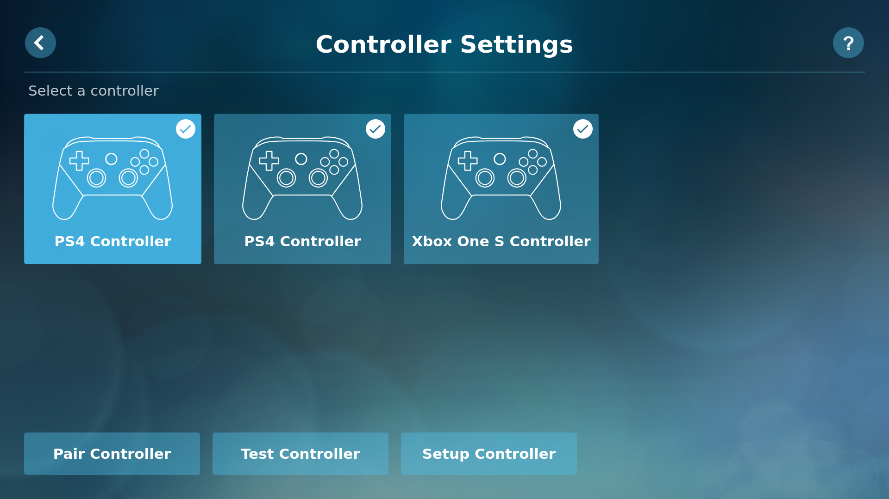

# HTPC

## Configure bluetooth controllers

### Hardware

- [Xbox One S Controller][Xbox Wireless Controller] and/or
- [PS4 Controller]
- The in-built Bluetooth 5.0 of the Raspberry Pi 4

### Features

The Xbox One S Wireless Controller and the PS4 Controller configured according
to this guide are perfectly supported by [Steam Link for Raspberry Pi].

- These controllers automatically reconnect to the Raspberry Pi when they are
  powered off/on.
- The mapping of the buttons is identical to when they are directly connected to
  a computer running Steam.
- The vibration functions of these controllers are fully supported when using
  Steam Link (confirmed when playing to [Cuphead])
- These controllers can be be simulatenously connected (confirmed with one Xbox
  One S Wireless Controller and two PS4 controllers)

### Install bluetoothctl

`bluetoothctl` is the main command for configuring Bluetooth devices on Linux.
Contrary to what the name's structure might lead you to expect, bluetoothctl is
not part of systemd, but rather a simple set of options for setting up Bluetooth
devices.

If you are running the latest Raspberry Pi OS, then all the software has already
been installed. If not, then you can simply type the following to install the
Bluetooth module.

    sudo apt-get install pi-bluetooth

Enable the bluetooth service to start at boot and check its status:

    sudo systemctl enable bluetooth
    sudo systemctl status bluetooth

### Disable ERTM

The Bluetooth *enhanced retransmission mode (ERTM)* is enabled by default on the
Raspberry Pi and prevents the Xbox One S controller to connect. From the
interface of `bluetoothctl` and when ERTM is enabled, attempting to connect to
the Xbox One S Controller (see next section) should result in the following loop.

    [bluetooth]# connect XX:XX:XX:XX:XX:XX
    Attempting to connect with XX:XX:XX:XX:XX:XX
    [CHG] Device XX:XX:XX:XX:XX:XX Connected: yes
    [CHG] Device XX:XX:XX:XX:XX:XX Connected: no
    [CHG] Device XX:XX:XX:XX:XX:XX Connected: yes
    [CHG] Device XX:XX:XX:XX:XX:XX Connected: no
    ...

ERTM is not needed for our application and can be safely disabled. We can
temporarily disable ERTM until the next reboot with the first command. The second
command confirms that ERTM has been successfully disabled.

    $ sudo bash -c 'echo 1 > /sys/module/bluetooth/parameters/disable_ertm'
    $ cat /sys/module/bluetooth/parameters/disable_ertm
    Y

If `bluetoothctl` is running when we disabled ERTM, we may need to exit and
run it again before attempting to connect to the controller. We can use the
command below to permanently disable ERTM starting from the next reboot.

    sudo bash -c "echo 'options bluetooth disable_ertm=Y' > /etc/modprobe.d/bluetooth.conf"

### Connect the controllers

Enter the following command on the Raspberry Pi to run `bluetoothctl`.

    bluetoothctl

Now that we are in the Bluetooth command-line tool, we need to go ahead and turn
the agent as well as start scanning for other devices. Enter `help` for a list
of all the options available.

    agent on
    scan on

We should start seeing an output similar to this one:

    [bluetooth]# scan on
    Discovery started
    [CHG] Controller DC:A6:32:05:7F:06 Discovering: yes
    [NEW] Device 51:B8:16:6A:6F:C6 51-B8-16-6A-6F-C6
    [NEW] Device 40:23:43:3F:4E:58 BRAVIA 4K UR2

The "Controller" prefix refers to the Raspberry Pi itself. "Devices" correspond
to the devices detected by the Raspberry Pi. From now on, we save the term
"controller" for the gaming controllers.

We can now turn on the pairing mode of the controller.

- [Xbox One S Controller][Xbox Wireless Controller]: Turn on the controller by
  pressing the Home button for less than one second. The light of the Home button
  should start to blink slowly, indicating that the controller is searching for
  a connection signal. Now press the Connect button on the top side of the
  controller to enable the pairing mode, which will results in making the Home
  button to blink faster.
- [PS4 Controller]: Unplug the power from your PS4 or turning on the controller
  will turn it on. Press and hold the PS and Share buttons on the controller at
  the same time. The light bar on the back of the controller will start flashing
  once pairing mode is active.

Now that the controller is discoverable, wait for the scan output of `bluetoothctl`
to show the controller. At the time of writing this guide, the Xbox One S Controller
should appear as "Xbox Wireless Controller" and the PS4 controller as "Wireless
Controller". Identify the MAC address of the controller (XX:XX:XX:XX:XX:XX) and
use it in the following commands:

    pair XX:XX:XX:XX:XX:XX
    trust XX:XX:XX:XX:XX:XX
    connect XX:XX:XX:XX:XX:XX

If the output of `connect XX:XX:XX:XX:XX:XX` is `yes`, the controller should now
be connected to the Raspberry Pi. The Home button of the Xbox One Wireless
controller should turn solid white and the main light of the PS4 controller should
turn solid blue for the first PS4 controller connect, red for the second, etc.

### Notes

- [xpadneo] is an Advanced Linux Driver for Xbox One Wireless Gamepad. This driver
  advertises the support of all Force Feedback/Rumble effects, Trigger Force
  Feedback and other features. I don't know if these features are exclusive to
  this driver or if they are now also part of the default driver used in this
  guide. I have successfully installed this driver but have uninstalled it after
  observing that Steam Link sometimes double-detect the controller, whcih results
  in every button pressed behaving as pressed twice. [xpadneo] also changes the
  the default mapping of the controller buttons. When this driver is used, the
  Xbox One S Controller vibrates upon connection.
- The command `steamlink` logs the folowing warnings/errors when using the default
  driver, however this does not translates in any noticeable issue.

  Xbox One S controller:

      (EE) libinput bug: Event for missing capability CAP_POINTER on device "Xbox Wireless Controller"

  PS4 controlller:

    <!-- markdownlint-disable MD032 MD034 -->
      (EE) event1  - Wireless Controller Touchpad: kernel bug: Touch jump detected and discarded.
      See https://wayland.freedesktop.org/libinput/doc/1.12.6/touchpad-jumping-cursors.html for details

- We can check the buttons and axis response of the controllers using the
  command-line tool `jstest`. First, we need to identify the `/dev/input` handler
  of our controllers by entering `cat /proc/bus/input/devices`. These handlers
  can not be used to uniquely identify controllers and depends on the order the
  controllers have been connected to the Raspberry Pi. The first controller
  connected should receive the handler `js0`, the second `js1`, etc. If one controller
  is disconnected, its handler will become available to the next controller to
  connect. Once we have identified the handler of the controller that we want to
  test, we can start `jstest`. For example:

        $ jstest --normal /dev/input/js0
        Driver version is 2.1.0.
        Joystick (Xbox Wireless Controller) has 8 axes (X, Y, Z, Rz, Gas, Brake, Hat0X, Hat0Y)
        and 15 buttons (BtnA, BtnB, BtnC, BtnX, BtnY, BtnZ, BtnTL, BtnTR, BtnTL2, BtnTR2, BtnSelect, BtnStart, BtnMode, BtnThumbL, BtnThumbR).
        Testing ... (interrupt to exit)
        Axes:  0:     0  1:     0  2:     0  3:     0  4:-32767  5:-32767  6:     0  7:     0 Buttons:  0:on   1:off  2:off  3:off  4:off  5:off  6:off  7:off  8:off  9:off 10:off 11:off 12:off 13:off 14:off sad

## Configure Audio

<!-- markdownlint-disable MD024 -->
### Hardware

- Jack audio speaker
- HDTV with HDMI ports
- [Micro-HDMI to HDMI TV Adapter Cable][uhdmi_hdmi_cable]
  - Recommended features: 4K Video at 60 Hz, Audio Return Channel (ARC)

### Test audio output devices

First we need to check that our audio hardware is functional before moving on with
the software configuration. For this test, we use the video player [Omxplayer]
specifically made for the Raspberry Pi's GPU from the Kodi project. Omxplayer
player is installed by default on Raspbian OS Lite.

### Test jack audio output

Connect your speaker or headset to the jack port of the Raspberry Pi. Run the
following commands to download and play an mp3 sample file with the audio output
directed to the jack port (`-o local`).

    curl -O https://raw.githubusercontent.com/tschaffter/raspberry-pi-htpc/master/audio/example.mp3
    omxplayer -o local example.mp3

### Test HDMI audio ouput

Connect your HDTV to the Raspberry Pi using a recent micro-HDMI to HDMI cable.
Over the years, many improvements have been brought by different versions
of the HDMI protocol and hardware to continuously improve audio support. Here we
connect the cable to the Raspberry Pi HDMI port adjacent to the USB-C power input
(labelled HDMI0) because only this port supports 4K with a 60Hz refresh rate.

Download the mp3 sample file if not done previously, and run `omxplayer` with
the argument `-o hdmi` to direct the audio to the TV speakers.

    curl -O https://raw.githubusercontent.com/tschaffter/raspberry-pi-htpc/master/audio/example.mp3
    omxplayer -o hdmi example.mp3

TODO: if audio does not go through: https://www.raspberrypi.org/documentation/configuration/audio-config.md
https://www.raspberrypi.org/documentation/usage/audio/

### Install PulseAudio

## Configure Video

### Set gpu_mem

Specifies how much memory, in megabytes, to reserve for the exclusive use of the
GPU on Raspberry Pi 1-3. The remaining memory is allocated to the ARM CPU. On the
Raspberry Pi 4 the 3D component of the GPU has its own memory management unit
(MMU), and does not use memory from the gpu_mem allocation. Instead memory is
allocated dynamically within Linux. This may allow a smaller value to be specified
for gpu_mem on the Pi 4, compared to previous models.

On Raspberry Pi 1 to 3, set the value of `gpu_mem` in `/boot/config.txt` up to
the value listed on this page that depends on the total RAM available on the Pi.

### Increase

## Steam Link

<!--   

Audio lag in HDMI is fairly common, but the causes are typically either video processing delay (which actually causes the video to lag, not the audio), or a sync problem in the case of video broadcasts.

On your host computer, find the audio playback settings and change your playback sample rate.

44100Hz and 48000Hz playback sample rates usually work well for streaming. Some users find that switching from one to the other fixes distortion or crackling. 

Yes. Seems to happen if there's ANY hiccups in FPS.

check power, could also be a ground issue

And...turning the display setting to anything other than 1080p fixed it. It must be the TV's deinterlacing process interfering with the Steam Link's.

Inhome streaming only properly supports 48KHz audio and MacOS by default uses 44.1KHz

Decreasing sound using alsamixer: crackling in the menu still present

Here is one way you could do it. (in /etc/asound.conf or ~/.asoundrc)

aplay example.mp3 is distorded!
omxplayer -o hdmi example.mp3 is OK

For wav you can use aplay. For mp3 you can use mpg123

$ aplay example.wav
Playing WAVE 'example.wav' : Signed 16 bit Little Endian, Rate 44100 Hz, Stereo

Most of the audio on TV is fine but crackling clearly due to TV broken speakers

=> Try bluetooth headphones

Update host GPU driver
Music on host pause when Steam Link start, then resume when turning Steam Link
    off.

## Install Kodi

https://dustinpfister.github.io/2020/03/27/linux-raspbian-lite-xserver-xorg/

sudo apt-get install -y xserver-xorg
sudo apt-get install -y xinit

Edit (or create) the file /etc/X11/Xwrapper.config with the following content:

allowed_users=anybody
needs_root_rights=yes

black box: window manager
lightdm: display manager

codafog/kodi-rpi: not updated in 3 years + error

## Install RetroPie

## Install Steam Link -->

<!-- Definitions -->

[Xbox Wireless Controller]: https://www.xbox.com/en-US/accessories/controllers/xbox-wireless-controller
[PS4 Controller]: https://www.playstation.com/en-us/explore/accessories/gaming-controllers/
[Steam Link for Raspberry Pi]: https://support.steampowered.com/kb_article.php?ref=6153-IFGH-6589
[Cuphead]: https://store.steampowered.com/app/268910/Cuphead/
[xpadneo]: https://github.com/atar-axis/xpadneo
[Omxplayer]: https://www.raspberrypi.org/documentation/raspbian/applications/omxplayer.md
[uhdmi_hdmi_cable]: https://www.amazon.com/gp/product/B014I8U6N0